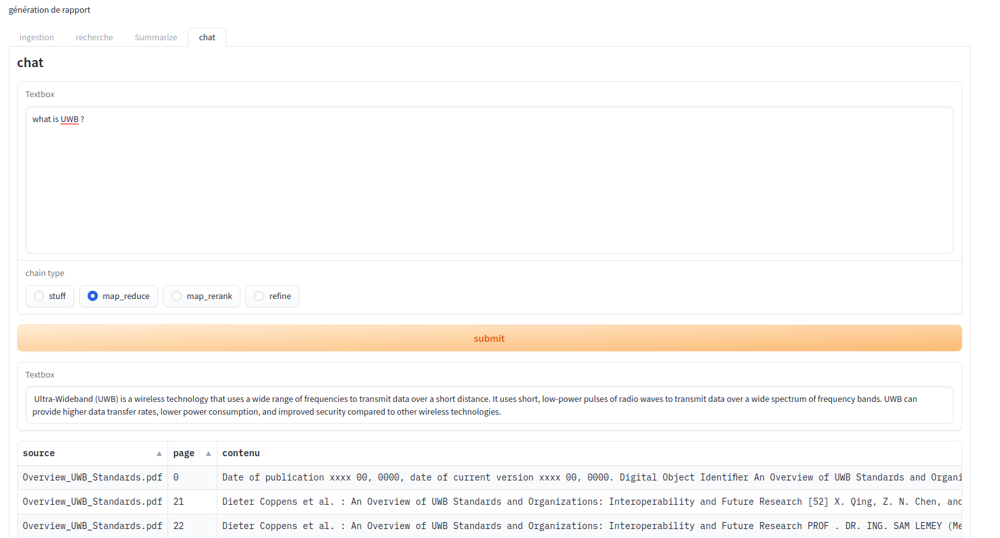

# PDF-GPT

## prepare the environment

you can get an openai api key from https://beta.openai.com/account/api-keys

    export OPENAI_API_KEY=sk-xxxxxxxxxxxxxxxxxxxxxxxxxxxxxxxxxxxxxxxx

install requirements

    python3 -m pip install -r requirements.txt

## usage 

launch the gradio app with:

    python3 app.py

then, go to http://172.0.0.1:7860/ and start playing with the model

REMINDER: you need to ingest data before querying the model. only supports pdf files for now.

## current state

## TODO

- [ ] add support for txt files
- [ ] add support for links
- [ ] add possibility to change the model
- [ ] add advanced options (temperature, top_p, etc.)
- [ ] add templates